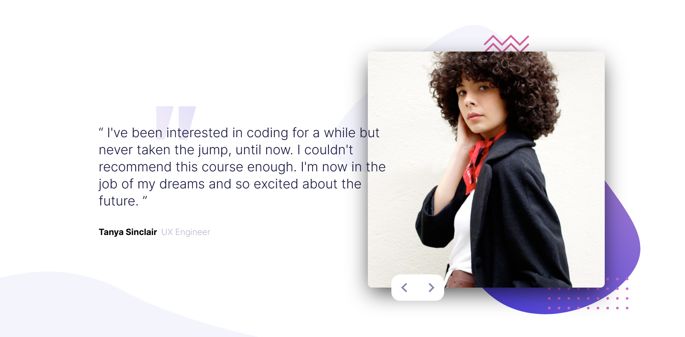

# Frontend Mentor - Coding bootcamp testimonials slider_9-20

This is a solution to the Coding bootcamp testimonials slider challenge

## Welcome! 👋

## Table of contents

- [Overview](#overview)
  - [Screenshot](#screenshot)
  - [Links](#links)
- [My process](#my-process)
  - [Built with](#built-with)
  - [What I learned](#what-i-learned)
  - [Continued development](#continued-development)
- [Author](#author)
- [Acknowledgments](#acknowledgments)

## Overview

### Screenshot

<!--  -->

### Links

- Solution URL: [Link to my solution git repo](https://github.com/breeMudi/coding-bootcamp-testimonials-slider-master_9-20)
- Live Site URL: [Link to project view on git-hub live server](https://breemudi.github.io/profile-card-component_2_20/)

## My process

- Create a draft of the website
- organize a template and duplicate for all testimonial Authors
- split each template into two main components (figure, content)
- position slider button relative to user image. make slider button responsive on hover
- for the mobile view, Leave the order of the various components as default block.
- Avoid hard-coding of dimensions as much as possible by using % and rem values.
- For the desktop view, set display to flex, align items to center.
- set flex direction to row-reverse. This is to enable the write-up to come first before the figure.
- adjust internal content to partially overlay on the figure.
- set initial testimonial containers to position absolute with left position of 2500px
- Only the first page will be kept as left: 0px. These values are then manipulated with JavaScript.

Finally- for JavaScript:

- add an 'on-click' function to the next and previous buttons
- pass in a list of 2 variables to the function. These variables are the class names wherein:
- for next-btn ( 0. current person in-view, 1. next person that can be viewed)
- for prev-btn ( 0. current person in-view, 1. previous person that was viewed)
- The JavaScript code is then used to query elements based on the names written in the on-click function

### Built with

- Semantic HTML5 markup
- CSS custom properties
- Flexbox
- Mobile-first workflow
- [Styled Components](https://styled-components.com/) - For styles

### What I learned

Through this exercise, I understood when to use flexbox and positioning syntaxes e.g relative, absolute.

I made use of the 100vh property to properly display the properties of individual cards.

I am super excited to have used JavaScript to enable seamless change from one testimonial and author to another

### Continued development

As part of my 20-frontendMentor project challenge series, here is project 9 of 20 ... yaay!

I have now started to learn the Reactjs framework. I cant wait to see how this project would be

carried out differently.

## Author

- Frontend Mentor - [@breeMudi](https://www.frontendmentor.io/profile/breeMudi)
- Twitter - [@Bridgetmudiaga](https://www.twitter.com/Bridgetmudiaga)

## Acknowledgments

Special thanks to Zach Goll (https://github.com/zachgoll/fullstack-roadmap-series) for his wonderful introduction to webdevelopment Bootcamp

